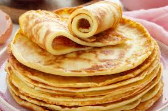

# Template
The german pancake is a flat dense pancake, which is thicker than the french crepe, but way thinner than the american pancake.
For me it's a typical dish from my youth, which is easy to make and depending your preference you can add savoury or sweet toppings.

**Provided by:** Ilka

## Stats
- Cooking Time: 15 minutes
- Servings: 3

## Ingredients
- 4 eggs
- 8 slightly mounted table spoons of flour (it's always double of the amount of eggs)
- 1 pinch of salt
- ca. 400 ml of cow milk (but more a feeling thing, how thick the batter should be)

## Instructions
1. Crack the eggs in the bowl and mix them.
2. Add the salt and first half of the flour.
3. Mix it until the batter is smooth.
4. Add the milk and mix again.
5. Add the second half of the flour, mix again, add more milk, if the batter feels too thick.
6. Heat a pan on your oven (medium heat) and put some oil or butter in it.
7. Pour 1 serving of a dipper of the batter in the pan and wait until it stiffens.
8. Flip it and cook from the other side.
9. Take it out of the pan and garnish it with whatever topping you prefer.
