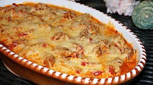

# Template

This is a baked dish usually served in Greek restaurants. It contains pan seared pork in a creamy tomato sauce with Metaxa brandy and is topped with melted cheese.
It is my absolute favorite whenever I go to greek restaurants and I was thrilled when I found out how easy and forgiving it is to make.

Tip: Eat with fries or crunchy oven potato slices.

**Provided by:** Yannik

## Stats

- Cooking Time: ...
- Servings: ...

## Ingredients

- 1 kg Butter
- 10 g Salt

## Instructions

- Step 1
- Step 2
