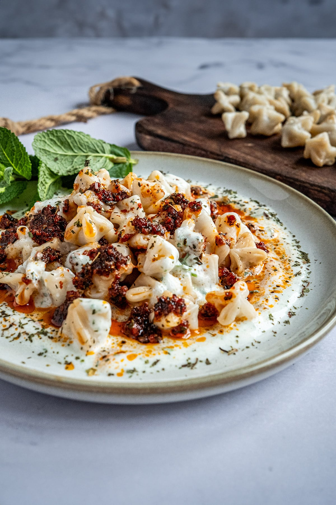

# Manti

Manti is a traditional Turkish dish made of small dumplings filled with minced meat. It is usually served with garlic yogurt and a warm butter sauce with paprika or chili flakes. For me, it is special because it is a traditional Turkish family meal.

**Provided by:** Mert Öksüz

## Stats
- Cooking Time: approximately 60 minutes
- Servings: 4

## Ingredients
- 500 g flour
- 1 egg
- 200 ml water
- 1 teaspoon salt
- 300 g minced beef
- 1 onion
- 1 teaspoon black pepper
- 1 teaspoon paprika
- 300 g yogurt
- 2 cloves of garlic
- 2 tablespoons butter
- 1 teaspoon chili flakes or paprika

## Instructions
- Mix flour, egg, water, and salt into a firm dough.
- Let the dough rest for about 20 minutes.
- Finely chop the onion and mix it with the minced beef, black pepper, paprika, and a little salt.
- Roll out the dough thinly and cut it into small squares.
- Place a small amount of filling in the center of each square.
- Fold and close the dough pieces into small dumplings.
- Boil the manti in salted water for about 10 to 15 minutes.
- Mix yogurt with crushed garlic.
- Melt butter in a small pan and add chili flakes or paprika.
- Serve the cooked manti with garlic yogurt and the warm butter sauce.

## Serving Tip
- Manti tastes best with garlic yogurt, melted butter, and a little paprika on top.

## Personal Note
- This dish is special to me because it is a traditional Turkish family meal.