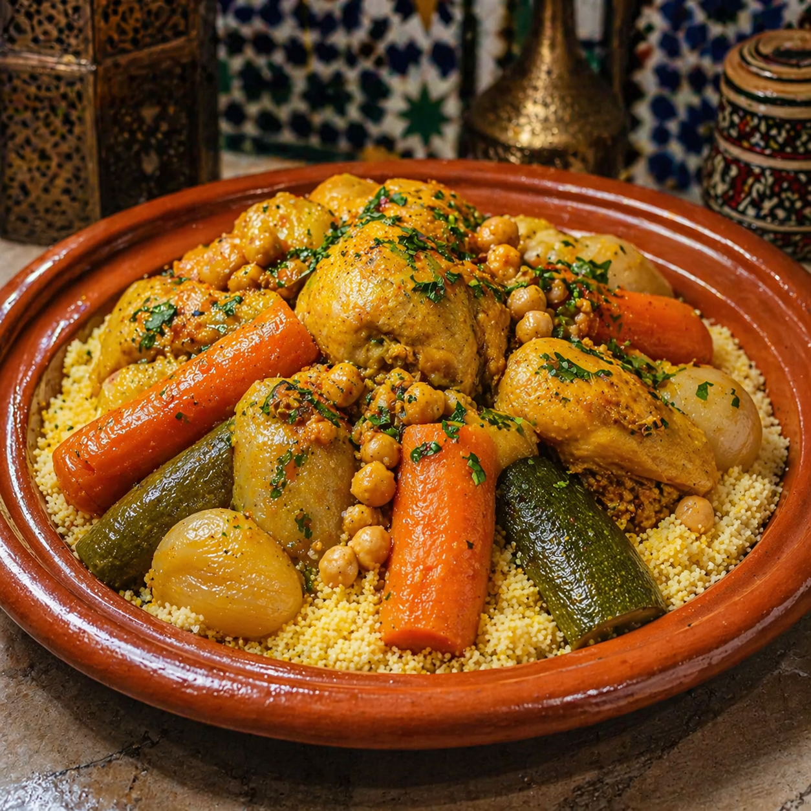

# Moroccan Couscous with Chicken

A classic dish from Moroccan cuisine, traditionally served on Fridays in many families. Tender chicken slowly simmers with colorful vegetables, chickpeas, and the signature spice blend Ras el Hanout until the flavors meld deeply. Served on fluffy, golden couscous. Simple, warming, and full of Maghreb sunshine.

Provided by: Yaacoub Harkat (or pseudonym)

## Stats

- Servings: 4 people (hearty portions)
- Prep Time: approx. 20 min
- Marinating Time: 15-30 min
- Cooking Time: approx. 50-55 minutes
- Total Time: approx. 1.5 Hours
- Difficulty: Medium
- Cuisine: Moroccan

## Ingredients

* 800 grams boneless chicken thighs or breast, cut into pieces
* 3 tablespoons olive oil
* 2 medium onions, chopped
* 3 garlic cloves, finely chopped
* 2 teaspoons Ras el Hanout
* 1 teaspoons ground cumin
* 1 teaspoons ground ginger
* 1 teaspoons turmeric
* 0.5 teaspoons cinnamon
* 1 teaspoons sweet paprika
* 1 teaspoons salt
* 0.5 teaspoons black pepper
* 3 carrots, cut into chunks
* 2 zucchini, cut into chunks
* 200 grams turnip or kohlrabi, diced
* 240 grams chickpeas (canned, drained)
* 400 grams chopped tomatoes (canned)
* 500 milliliters chicken broth
* 3 tablespoons fresh cilantro, chopped
* 3 tablespoons fresh parsley, chopped
* 300 grams couscous
* 350 milliliters water or broth (for the couscous)
* 30 grams butter
* 50 grams raisins (optional)
* 2 tablespoons toasted slivered almonds (for garnish)

## Instructions

1. **Season the chicken:** Place the **800** **grams** **boneless chicken thighs or breast, cut into pieces** in a bowl. Add **2** **teaspoons** **Ras el Hanout**, **1** **teaspoons** **ground cumin**, **1** **teaspoons** **ground ginger**, **1** **teaspoons** **turmeric**, **0.5** **teaspoons** **cinnamon**, **1** **teaspoons** **sweet paprika**, **1** **teaspoons** **salt**, and **0.5** **teaspoons** **black pepper**, then mix and massage well into the meat. Ideally let it marinate for 15–30 minutes.
2. **Sauté onions and garlic:** Heat the **3** **tablespoons** **olive oil** in a large pot (or tagine). Sweat the **2** **medium onions, chopped** over medium heat for about 6 minutes until translucent, then add the **3** **garlic cloves, finely chopped** and cook for 1 more minute.
3. **Brown the chicken:** Add the marinated **800** **grams** **boneless chicken thighs or breast, cut into pieces** to the pot and sear on all sides until browned (about 5–7 minutes).
4. **Add the vegetables:** Add the **3** **carrots, cut into chunks** and **200** **grams** **turnip or kohlrabi, diced** to the chicken and cook for 3 minutes.
5. **Simmer:** Pour in the **400** **grams** **chopped tomatoes (canned)** and **500** **milliliters** **chicken broth**. Bring to a boil, then reduce heat, cover, and simmer for 20 minutes.
6. **Add zucchini and chickpeas:** Stir in the **2** **zucchini, cut into chunks** and **240** **grams** **chickpeas (canned, drained)**. Simmer for another 10–15 minutes until everything is tender and the chicken is cooked through.
7. **Prepare the couscous:** Bring the **350** **milliliters** **water or broth (for the couscous)** to a boil with a pinch of salt. Remove from heat, stir in the **300** **grams** **couscous**, add the **30** **grams** **butter** and optionally the **50** **grams** **raisins (optional)**. Cover and let steam for 5–7 minutes, then fluff with a fork.
8. Season & serve: Finish the stew with half of the **3** **tablespoons** **fresh cilantro, chopped** and **3** **tablespoons** **fresh parsley, chopped**. Place the couscous on plates, arrange the chicken with vegetables and sauce on top. Garnish with the remaining cilantro, parsley, and **2** **tablespoons** **toasted slivered almonds (for garnish)**.
