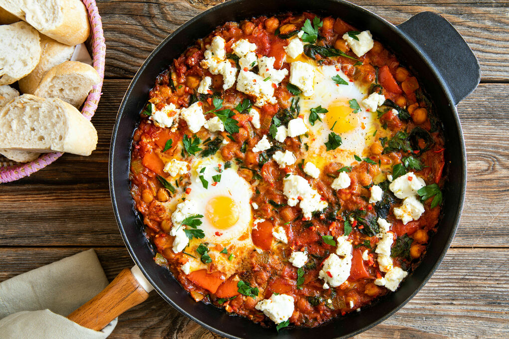

# Shakshuka (North African Tomato & Egg Dish)

## 📝 Description
Shakshuka is a flavorful and comforting dish originating from North Africa, widely enjoyed across countries like Tunisia, Libya, and Morocco. It consists of poached eggs simmered in a rich, spiced tomato and pepper sauce, often served with crusty bread for dipping. It’s a popular breakfast or brunch dish but works just as well for lunch or dinner.

**Provided by:** Julian Klopsch

---

## ⏱️ Cooking Stats
- **Prep Time:** 10 minutes  
- **Cook Time:** 25 minutes  
- **Total Time:** 35 minutes  
- **Servings:** 3–4  
- **Difficulty:** Easy  

---

## 🛒 Ingredients
- 2 tablespoons olive oil  
- 1 medium onion, finely chopped  
- 2 red bell pepper, diced  
- 3 cloves garlic, minced  
- 2 teaspoon ground cumin  
- 2 teapoon smoked paprika  
- 1 teaspoon chili flakes (optional)  
- 1-2 cans (400g) crushed tomatoes
- 1 can (200g) chickpeas  
- Salt and black pepper 
- 4 large eggs  
- Fresh parsley and cilantro, chopped  
- Feta cheese (100-200g) diced  
- Crusty bread (for serving) 

---

## 👨‍🍳 Instructions

1. **Heat the oil**  
   In a large skillet, heat the olive oil over medium heat.

2. **Fry vegetables**  
   Add the chopped onion and bell pepper. Cook for about 5–7 minutes until softened. Stir in the garlic and cook for another minute.

3. **Add spices**  
   Sprinkle in cumin, smoked paprika, and chili flakes. Stir well to coat the vegetables and release the aromas.

4. **Simmer the sauce**  
   Pour in the crushed tomatoes. Season with salt and pepper. Let the mixture simmer for 10–15 minutes until slightly thickened.

5. **Add the eggs**  
   Make small wells in the sauce and crack the eggs into them. Cover the skillet and cook until the eggs are set to your liking (about 5–8 minutes).

6. **Garnish and serve**  
   Remove from heat. Sprinkle with fresh herbs and feta cheese. Serve immediately with warm bread.

---

## 💡 Tips
- Adjust spice levels to your taste by increasing or reducing chili flakes.   
- Best enjoyed straight from the pan while still warm!

---

