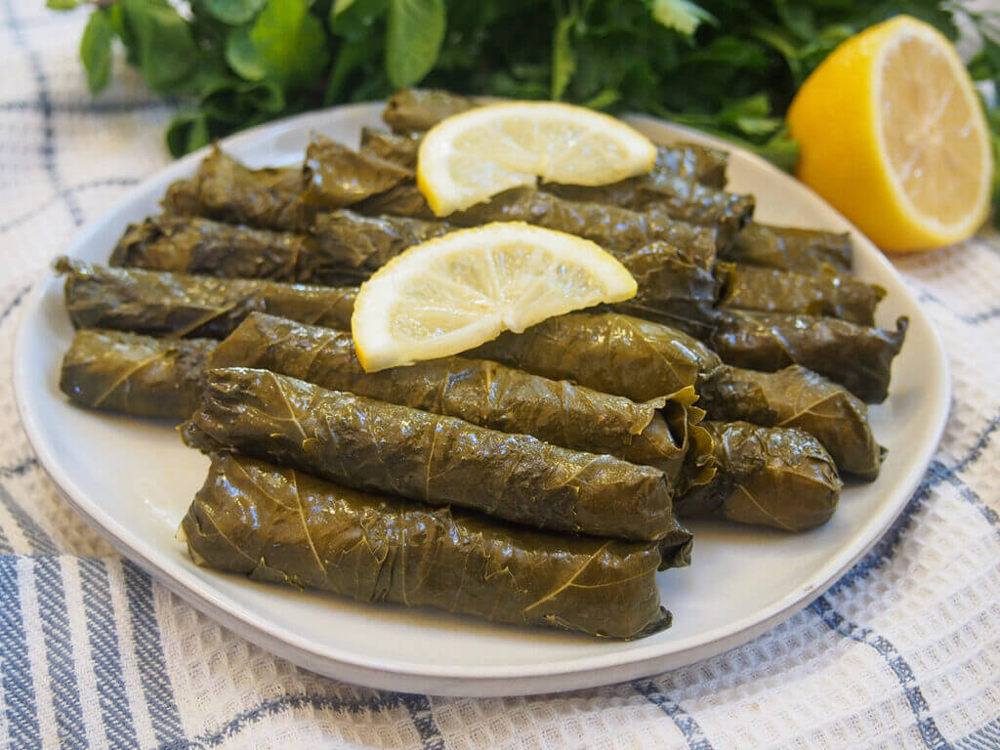

# Dolma (Stuffed Grape Leaves)

Dolma is one of my favorite dishes. It is made with grape leaves filled with rice, herbs, and spices. I like it because it tastes fresh and can be served warm or cold.

**Provided by:** Mehmo52

## Stats
- Cooking Time: about 1 hour 35 minutes
- Servings: about 40 pieces (4 to 6 people)

## Ingredients
- Grape leaves, jarred or fresh, about 40 leaves
- Short-grain rice, 1 cup (200 g)
- Onions, finely diced, 2 medium
- Tomatoes, finely diced, 2 medium
- Fresh parsley, chopped, 1 large bunch
- Fresh mint, chopped, 1/2 bunch
- Fresh dill, chopped, 1/2 bunch
- Lemon juice, 3 tbsp
- Olive oil, 4 tbsp
- Tomato paste, 1 tbsp
- Salt, 1 tsp
- Black pepper, 1/2 tsp
- Allspice, 1/2 tsp
- Cumin, 1/4 tsp
- Water or vegetable broth, 2 cups

## Instructions
1. If you are using jarred grape leaves, rinse them well under cold water to remove excess brine. If you are using fresh leaves, blanch them in boiling water for 2 to 3 minutes until softened. Pat them dry and set them aside.
2. Rinse the rice and let it drain. In a large bowl, combine the rice, onions, tomatoes, parsley, mint, dill, 2 tbsp olive oil, 1 tbsp lemon juice, tomato paste, salt, black pepper, allspice, and cumin. Mix everything thoroughly.
3. Place one grape leaf shiny-side down on a flat surface, with the stem end facing you. Trim any thick stem if needed. Add about 1 tablespoon of filling near the bottom. Fold the bottom over the filling, fold in the sides, and roll it up tightly toward the tip.
4. Line the bottom of a heavy-bottomed pot with a few torn or leftover grape leaves to prevent sticking. Place the rolled grape leaves seam-side down in tight rows. You can layer them if needed.
5. Mix the remaining 2 tbsp olive oil, 2 tbsp lemon juice, and 2 cups of water or broth. Pour the liquid over the grape leaves. Place a heatproof plate on top to keep them in place while cooking. Bring everything to a boil, then reduce the heat to low, cover, and simmer for 45 to 50 minutes until the rice is fully cooked.
6. Let the stuffed grape leaves cool slightly before serving. They taste great both warm and cold. Serve with fresh lemon juice and plain yogurt on the side.

## Tips & Tricks
- Do not overfill the leaves, because the rice expands during cooking.
- Roll them tightly so they keep their shape.
- Place a plate on top while cooking so they do not open.
- They often taste even better the next day.
- Serve with lemon wedges and plain yogurt.
