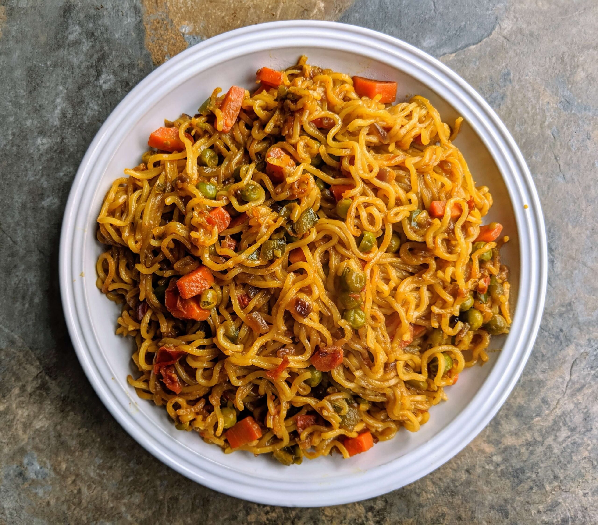

# Maggi Noodles

## Ingredients
- 1 packet Maggi
- 1 cup water

## Instructions
1. Boil water
2. Add noodles
3. Add tastemaker
4. Cook 2 minutes

## Cooking Time
5 minutes

## Tips
- Add butter for taste
