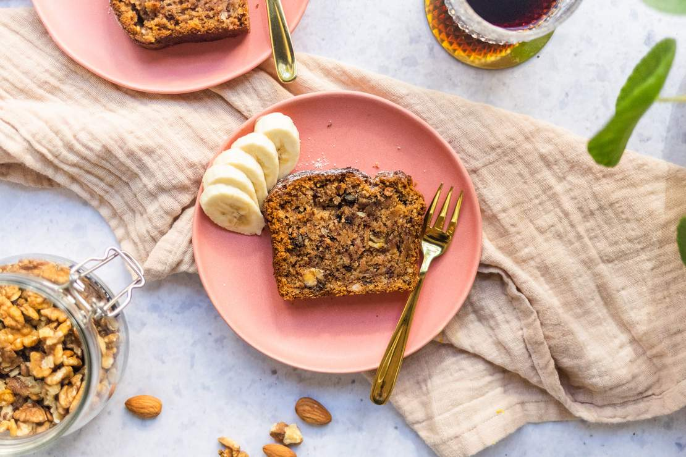

# Vegan banana bread with walnuts & chocolate
For me, banana bread is the perfect easy and quick cake-like treat. My girlfriend makes the best one, and I am always happy when she bakes it for us.

**Provided by:** Frederik

## Stats
- Cooking Time: 15 minutes in preparation; 60 minutes baking time 
- Servings: 12 portions

## Ingredients
- 300 g spelt flour
- 10 g baking soda
- Pinch of salt
- 2 ripe bananas
- 250 g applesauce
- 135 ml vegetable milk (vegan like milk alternatives are recommended)
- 150 g organic walnut kernels
- 75 g chocolate drops

## Instructions
- Step 1
- Step 2