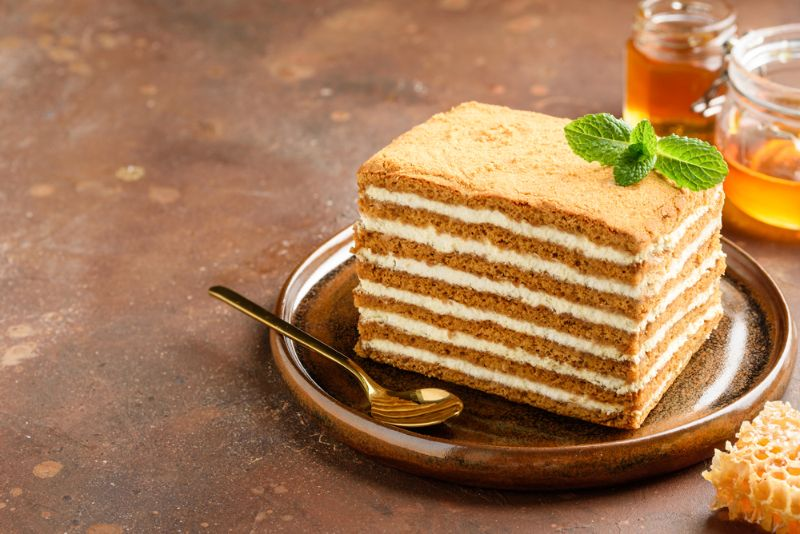

# Honey cake
It’s a traditional Latvian cake that we enjoy on birthdays, name days, and other celebrations.
It’s one of my favorite cakes.

**Provided by:** Marta Veinberga

## Stats
- Cooking Time: 1 hour + 6 hours chilling
- Servings: 12

## Ingredients
**Cake layers**
- 375 g flour
- 100 g sugar
- 3 tablespoons honey
- 115 g butter
- 2 eggs
- 1 teaspoon baking soda
- 2–3 tablespoons water

**Cream filling:**
- 480 g heavy cream
- 100 g sugar

## Instructions
1. Melt butter, sugar, and honey together in a saucepan over low heat.
2. Remove from heat and let cool slightly.
3. Beat in the eggs.
4. Dissolve baking soda in water, then add to the mixture.
5. Gradually add flour to form a soft, non-sticky dough.
6. Divide dough into 6–8 equal parts.
7. Roll each part into a thin round layer.
8. Bake at 175°C for 5–7 minutes until lightly golden.
9. Mix sour cream (or heavy cream) with sugar and vanilla until smooth.
10. Place one layer on a plate, spread cream over it.
11. Repeat with remaining layers.
12. Spread cream over the top layer.
13. Refrigerate for at least 6 hours so the layers absorb the cream and soften.