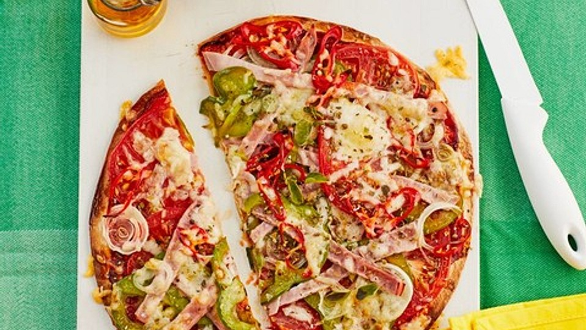

# Dish Name
Short Description of the dish, and why it's special for you.

**Provided by:** Richard Sterk

## Stats
- Cooking Time: 15 Min
- Servings: 1-2 Person 

## Ingredients

- 1 Tortilla(s)
- 2 tbsp tomato paste
- 1 tbsp water
- 1 tsp pizza spice
- 1 slice(s) of cooked ham
- 1 bell pepper(s)
- 1 small onion(s)
- 1 large tomato(s)
- 5 pepperoni/chili peppers
- 45 g cheese, grated
- 1 tsp oregano

## Instructions

- Step 1
    Mix the tomato paste with the water and stir well. Mix in the pizza spice. Spread the tomato sauce evenly on the tortilla wrap.
- Step 2
    Cut the cooked ham, bell pepper, tomato, onion, and pepperoni into small pieces and distribute them on the pizza. Of course, the toppings can be substituted as desired. Then, sprinkle the cheese evenly over the pizza and garnish it with a pinch of oregano.
- Step 3
    Slide the pizza into the oven, preheated to 200 °C top/bottom heat, for a good 10 minutes.

Warning! : Slide the pizza into the oven, preheated to 200 °C top/bottom heat, for a good 10 minutes. Watch closely so the edges don't burn.

For a vegetarian option, use mushrooms and more bell peppers instead of ham.
A bit of garlic powder in the tomato sauce also tastes great. :)

