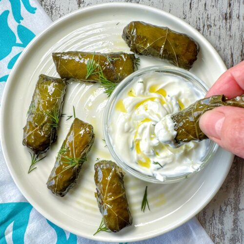

# Dolma (Stuffed Grape Leaves)

Dolma is a popular Azerbaijani dish made by wrapping grape leaves with a mixture of minced meat, rice, and herbs.  
It’s one of the most traditional dishes in Azerbaijani cuisine.

**Provided by:** Mehdi Gurbanzade

## Stats
- Cooking Time: ~40 minutes
- Servings: 4

## Ingredients
- 250 g minced meat  
- 100 g rice  
- 1 onion (chopped)  
- 1 bunch grape leaves  
- Fresh herbs (dill, parsley, coriander)  
- Salt, pepper, paprika  

## Instructions
1. Prepare grape leaves (blanch fresh or rinse pickled).  
2. Mix minced meat, rice, onion, herbs, and spices.  
3. Place filling on a leaf, fold sides, roll tightly.  
4. Arrange dolmas in a pot, cover with water or broth, put a small plate on top.  
5. Cook on low heat for about 40 minutes.  
6. Serve hot with plain or garlic yogurt.  
