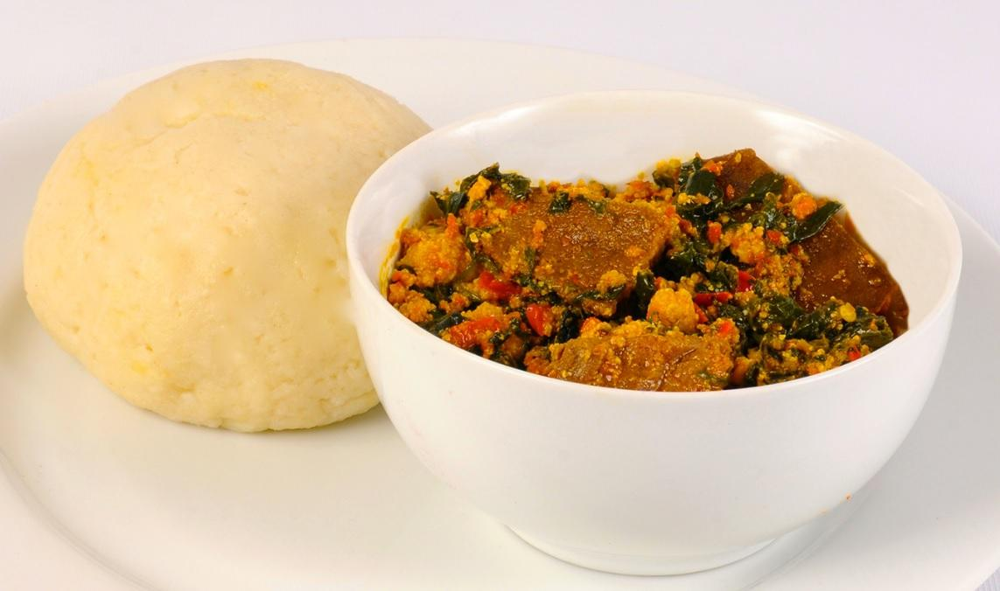

# The Ultimate Egusi Soup

### A Taste of Nigeria 

The only thing that comes into my head after a long day of classes is egusi soup with 'plenty passengers'. It has a nutty taste that makes me feel like a good night's rest is assured and can be paired with a swallow or rice.

> **Note**: "Plenty passengers" is a Nigerian slang for a generous mix of fish and meat in a soup.

---
* **Prep time:** 45 minutes (plus 1 hour for soaking stockfish)
* **Cook time:** 40 minutes
* **Serves:** 6-8 people
---

## Ingredients

#### For the Soup Base
* 4 cups (500g) **Egusi** (Melon seeds) or pumpkin seeds, ground
* 3 cooking spoons **Red Palm Oil**
* 4-5 cups **Meat/Fish Stock** (and hot water as needed)
* 1 small **Ogiri Okpei** (optional, for traditional flavor)

#### Proteins (The "Passengers")
* **Beef** (your preferred cut)
* **Shaki** (Cow Tripe)
* **Dry Fish**
* **Stockfish**
* **Kpomo** (Cow skin)

#### Seasoning & Aromatics
* 2 tablespoons **Ground Crayfish**
* **Ground Red Pepper** (to taste)
* **Salt** (to taste)
* 3 small beef flavoured **Stock Cubes** (Maggi or Knorr)

#### Vegetable
* A generous bunch of **Nigerian Pumpkin Leaves** (Ugu)
* *Alternatives*: Spinach or washed Bitter Leaf
* *Alternative to the alternative*: Kale leaf

## Preparation Steps (Before You Cook)

1.  **Prepare Proteins:**
    * Soak the dry fish and stockfish in hot water until soft. If your stockfish is very tough, boil it for 20 minutes first, then let it soak for an hour.
    * Once soft, de-bone the fish and break it into chunks.
    * Cook the beef, shaki, and stockfish with the stock cubes until tender. Start with the toughest items (shaki, stockfish) and add the beef later. Keep the stock!

2.  **Prepare Other Ingredients:**
    * Grind the egusi seeds into a fine powder using a coffee grinder or a powerful blender.
    * Grind the crayfish and dry pepper.
    * Wash your vegetables thoroughly and slice them into thin pieces.

## Cooking Instructions

1.  **Fry the Egusi:** Pour the palm oil into a dry pot on medium heat. Once the oil melts, add the ground egusi. Stir continuously until every grain is coated in oil and turns a light yellow. Fry for about 10 minutes, stirring constantly to prevent burning. The egusi should look like a crumbly paste.

2.  **Form the Paste:** Begin adding the hot meat/fish stock, a little at a time, while still stirring. As you add liquid, the egusi will thicken and start to form lumps. Continue this process until all the stock is used. If the soup is too thick, add hot water until you reach your desired consistency.

3.  **Simmer:** If you're using bitter leaves, add them now. Cover the pot, reduce the heat, and let it simmer for 10-20 minutes. Stir every 5 minutes to prevent burning at the bottom. The egusi is perfectly cooked when you see the red palm oil separating and floating to the top.

4.  **Combine and Finish:**
    * Add the ground crayfish and pepper, and stir well.
    * Add your cooked meats and fish to the pot.
    * Stir in your sliced pumpkin leaves (or spinach or kale). They only need a minute or two to wilt.
    * Taste and adjust seasoning with salt if needed.

5.  **Simmer:** Let the soup simmer for another 2-3 minutes for all the flavors to marry. Your Egusi Soup is ready!

## Serving Suggestions

Egusi soup is best served hot with a "swallow" food or simple steamed rice. Swallows are soft, pliable doughs used to scoop up the soup. Popular options include:
* **Pounded Yam**
* **Eba** (made from garri/cassava flakes)
* **Fufu** (fermented cassava dough)
* **Semovita**
