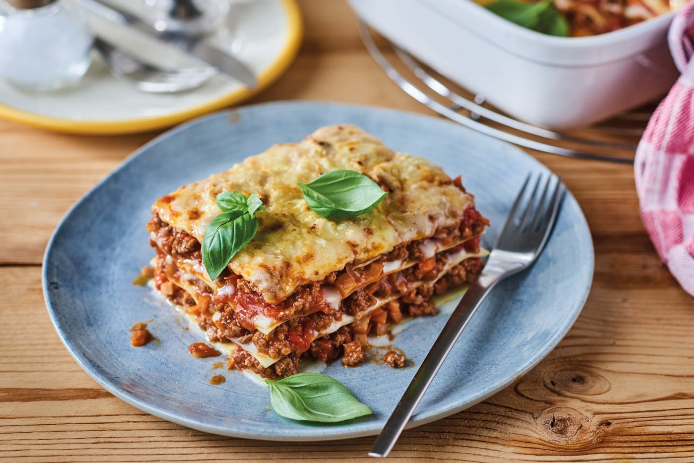

# Lasagne
Lasagne is special, because it always tastes better at home than at a restaurant.

**Provided by:** MiriSchm

## Stats
- Cooking Time: 3 hours
- Servings: 6

## Ingredients
-For the Bolognesesauce:
-500 g Minced Meat
-1 Onions
-2 Garlic
-1 Parsley
-1 EL Tomato paste
-1 Can of tomatoes
-some Red wine

-For the Béchamelsauce:
-0.5 Liter Milk
-30 g Butter
-40 g Flour
-Salt and Pepper
-Lemon cest
-Nutmeg

-Additionally:
-300 g Lasagne sheet
-Unlimited gouda cheese, grated

## Instructions
-Ragù Bolognese:
Heat the olive oil in a pot, brown the ground beef, and add the chopped onions and parsley. Stir in the finely sliced garlic and tomato paste and fry together. Pour in the canned tomatoes, season with salt and pepper. Add red wine to taste. Simmer the ragù for at least half an hour with the lid off.
-Béchamel sauce:
Melt the butter in a small saucepan, stir in the flour with a whisk and sauté until light yellow. Pour in the milk and stir the sauce until smooth. If you have stirred too slowly and find lumps in the sauce, you can pass the sauce through a fine hair sieve and then continue cooking. The sauce should simmer on a low heat for almost half an hour so that it loses its floury taste. Season to taste with salt, pepper, lemon juice, and a little nutmeg.
-Preparation of the lasagna:
Spread some ragù Bolognese in a buttered, ovenproof dish, place a layer of lasagna sheets on top, cover the pasta layer with ragù again and then with a layer of béchamel. 
Then add another layer of pasta, ragù and béchamel. Fill the dish layer by layer. 
The last layer should be béchamel sauce. Sprinkle generously with grated cheese and dot with butter. 
Bake the lasagna in a hot oven at 180°C for about 30-40 minutes, until the crust is golden brown.
