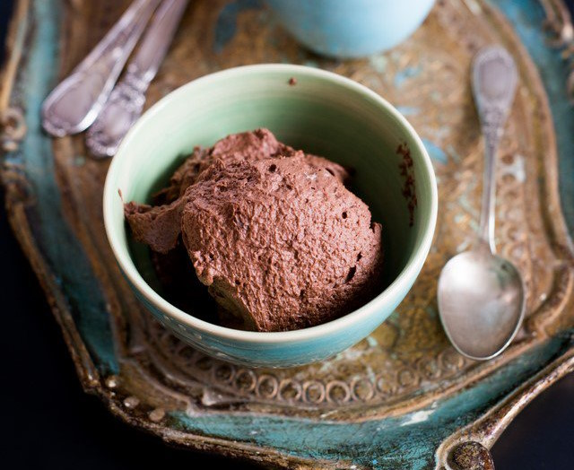

# Mousse Au Chocolat
Mousse Au Chocolat is not only a french classic but a standard dish that my family eats every year for christmas. Lucky for us our family recipe is not only very delicious (source: everyone) but easy to make as well. It has never failed me.

**Provided by:** Caro

## Stats
- 14 hours (good things take time)
- Servings: Around 6ish

## Ingredients
- 600 g Whipped Cream (can't be substitued by vegan alternatives, I am sorry it will not reach a mousse texture)
- 200 g Dark Chocolate (It is key to buy GOOD chocolate, otherwise the mousse will not taste good. Don't buy cheap chocolate!!!)
- 100 g Milk Chocolate (It is key to buy GOOD chocolate, otherwise the mousse will not taste good. Don't buy cheap chocolate!!!)
- Sugar
- Brandy (I don't believe in expensive alcohol, so you can be cheap here.)
- Orange

## Instructions
- Step 1
- Step 2