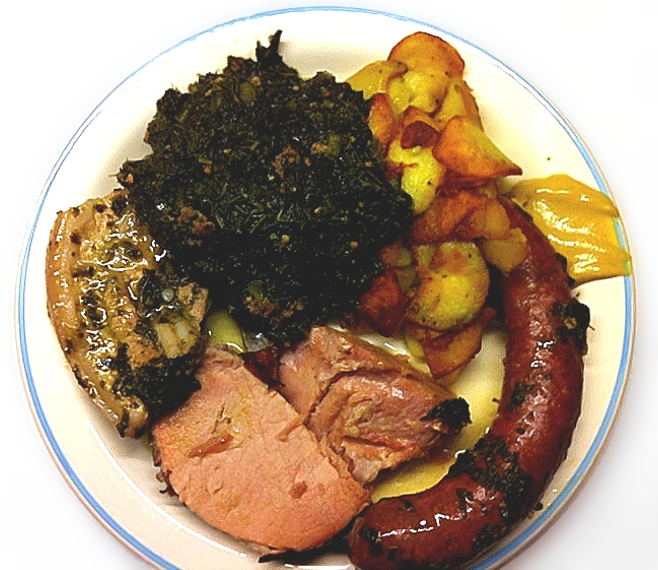

# Tofu in Tomato Sauce
## (In Vietnamese: Dau Phu Sot Ca Chua)

**Provided by:** Julia Nguyen (with reference to my mom and [https://www.mimirosefoodlove.com/dau-phu-sot-ca-chua-tofu-in-tomatensauce/](https://www.mimirosefoodlove.com/dau-phu-sot-ca-chua-tofu-in-tomatensauce/))

## Stats
- Cooking Time: 1h45min
- Servings: 2 portions

## Ingredients
- 450g Tofu (please not the ones in the supermarket, go to the Asian supermarket)
- Oil (that can do frying temperature)
- 6 beef tomatoes
- 2 Onions
- 1 tbsp. vegetable broth
- 1 tsp. sugar
- 2-3 tbsp. fish sauce or soy sauce
- pepper
- green onions
- coriander 
## Instructions
1. Cut the tofu in slices and fry it in oil.
2. Cut the tomatoes in smaller pieces. 